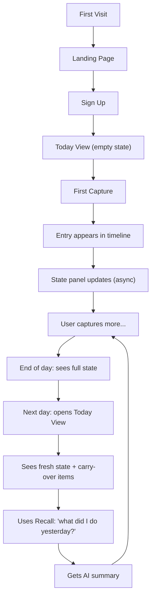

# Flowra — UI/UX Specification

> **Version:** 1.0  
> **Date:** 2026-04-23  
> **Status:** Draft  

---

## 1. Design Philosophy

**Three Principles:**

1. **Calm** — This is a tool people open 5–10x/day. It must feel quiet, not overwhelming.
2. **Instant** — Capture must feel like a reflex. Zero friction from thought to entry.
3. **Aware** — The interface should subtly communicate "I know what's going on" without being noisy.

**Visual DNA:**
- Dark mode primary (with light mode option)
- Soft gradients, not flat colors
- Generous whitespace
- Subtle glassmorphism for panels
- Smooth micro-animations for every interaction

---

## 2. Design System

### 2.1 Color Palette

```
/* Dark Mode (Primary) */
--bg-primary:      #0a0a0f;       /* Deep space black */
--bg-secondary:    #12121a;       /* Card/panel background */
--bg-tertiary:     #1a1a2e;       /* Elevated surfaces */
--bg-glass:        rgba(255, 255, 255, 0.03);  /* Glassmorphism */

--text-primary:    #e8e8ed;       /* Main text */
--text-secondary:  #8888a0;       /* Subdued text */
--text-tertiary:   #55556a;       /* Hints, timestamps */

--accent-primary:  #6c5ce7;       /* Purple — brand color */
--accent-glow:     rgba(108, 92, 231, 0.15);  /* Glow effects */
--accent-hover:    #7c6cf7;       /* Hover state */

--status-action:   #ff6b6b;       /* Red — action items */
--status-blocker:  #ffa502;       /* Amber — blockers */
--status-done:     #2ed573;       /* Green — completed */
--status-deadline: #3498db;       /* Blue — deadlines */

--border-subtle:   rgba(255, 255, 255, 0.06);
--border-focus:    rgba(108, 92, 231, 0.5);

/* Light Mode */
--bg-primary-light:    #f8f8fc;
--bg-secondary-light:  #ffffff;
--text-primary-light:  #1a1a2e;
--text-secondary-light:#6b6b80;
```

### 2.2 Typography

```
/* Font: Inter (Google Fonts) */
--font-family:     'Inter', -apple-system, sans-serif;

--text-xs:         0.75rem;    /* 12px — timestamps */
--text-sm:         0.875rem;   /* 14px — secondary text */
--text-base:       1rem;       /* 16px — body */
--text-lg:         1.125rem;   /* 18px — subtitles */
--text-xl:         1.5rem;     /* 24px — section headers */
--text-2xl:        2rem;       /* 32px — page titles */

--weight-normal:   400;
--weight-medium:   500;
--weight-semi:     600;
--weight-bold:     700;
```

### 2.3 Spacing Scale

```
--space-1:  4px;
--space-2:  8px;
--space-3:  12px;
--space-4:  16px;
--space-5:  20px;
--space-6:  24px;
--space-8:  32px;
--space-10: 40px;
--space-12: 48px;
--space-16: 64px;
```

### 2.4 Component Styles

```
/* Cards */
--radius-sm:   8px;
--radius-md:   12px;
--radius-lg:   16px;
--radius-xl:   24px;

/* Shadows */
--shadow-sm:   0 1px 3px rgba(0, 0, 0, 0.3);
--shadow-md:   0 4px 12px rgba(0, 0, 0, 0.4);
--shadow-glow: 0 0 20px rgba(108, 92, 231, 0.15);

/* Transitions */
--ease-out:    cubic-bezier(0.16, 1, 0.3, 1);
--duration-fast:   150ms;
--duration-normal: 250ms;
--duration-slow:   400ms;
```

---

## 3. Screen Specifications

### 3.1 Login / Register

```
┌──────────────────────────────────────────────────────┐
│                                                      │
│                    ✦ flowra                           │
│                                                      │
│            Your life, reconstructed.                 │
│                                                      │
│         ┌──────────────────────────────┐             │
│         │  Email                       │             │
│         └──────────────────────────────┘             │
│         ┌──────────────────────────────┐             │
│         │  Password                    │             │
│         └──────────────────────────────┘             │
│                                                      │
│         ┌──────────────────────────────┐             │
│         │        Continue →            │             │
│         └──────────────────────────────┘             │
│                                                      │
│           Don't have an account? Sign up             │
│                                                      │
│  ─────────── Ambient animated gradient ──────────── │
└──────────────────────────────────────────────────────┘
```

**Details:**
- Centered card with glassmorphism
- Animated gradient background (slow-moving purple/blue)
- Logo at top with subtle glow
- Input fields with focus glow effect (purple border)
- Button with gradient fill and hover lift

---

### 3.2 Today View (Main Screen — Default)

```
┌───────┬───────────────────────────────────────────────┐
│       │  Today, Apr 23                    👤 Piyush  │
│  ✦    │───────────────────────────────────────────────│
│       │                                               │
│ Today │  ┌─────────────────────────────────────────┐  │
│       │  │  What's happening?                      │  │
│ ──    │  │  ____________ (multiline expandable)    │  │
│       │  │                              [Capture]  │  │
│  📅   │  └─────────────────────────────────────────┘  │
│       │                                               │
│ Time- │  ── Your State ──────────────────────────── │
│ line  │  │ 🔴 3 action items  │ 🟡 1 blocker       │  │
│       │  │ 🟢 5 completed     │ 🔵 2 deadlines     │  │
│ ──    │  └──────────────────────────────────────────┘  │
│       │                                               │
│  🔍   │  ── Timeline ────────────────────────────── │
│       │                                               │
│ Recall│  11:42 PM ·                                  │
│       │  Had call with Rajesh about API pricing.     │
│ ──    │  Need to follow up by Friday.                │
│       │  ┌────────┐ ┌──────────┐ ┌────────┐         │
│  ⚙️   │  │🔴 follow│ │🔵 Friday │ │📋 call │         │
│       │  └────────┘ └──────────┘ └────────┘         │
│ Set-  │                                               │
│ tings │  10:15 PM ·                                  │
│       │  Started working on auth flow.               │
│       │  Blocked on OAuth docs.                      │
│       │  ┌──────────┐ ┌───────────┐                  │
│       │  │🟡 blocker │ │📋 auth    │                  │
│       │  └──────────┘ └───────────┘                  │
│       │                                               │
│       │  09:30 PM ·                                  │
│       │  Reviewed PRs. Merged 2.                     │
│       │  ┌────────┐ ┌──────────┐                     │
│       │  │🟢 done  │ │📋 review │                     │
│       │  └────────┘ └──────────┘                     │
│       │                                               │
└───────┴───────────────────────────────────────────────┘
```

**Layout Details:**
- **Sidebar** (60px): Icon-based nav, collapsible
- **Capture Input**: Top of page, always visible, expands on focus. `Ctrl+Enter` or button to submit
- **State Panel**: 4 metric cards in a grid, color-coded, with counts. Clickable to filter timeline
- **Timeline**: Reverse chronological. Each entry shows raw text + extracted badges below it
- **Entry badges**: Pill-shaped, color-coded by type (action=red, blocker=amber, done=green, tag=gray)

**Interactions:**
- Capture input expands with smooth animation on focus
- New entries animate in from top with slide-down
- State panel counts animate (counter roll) when updated
- Badges appear with staggered fade-in after entry loads
- Hover on entry shows subtle highlight + delete option

---

### 3.3 Timeline View (Full History)

```
┌───────┬───────────────────────────────────────────────┐
│       │  Timeline                 [Date Picker ▾]    │
│  Nav  │───────────────────────────────────────────────│
│       │                                               │
│       │  ── Wednesday, Apr 23 ──────────────────── │
│       │                                               │
│       │  (entries for the day...)                     │
│       │                                               │
│       │  ── Tuesday, Apr 22 ────────────────────── │
│       │                                               │
│       │  (entries for the day...)                     │
│       │                                               │
│       │  ── Monday, Apr 21 ─────────────────────── │
│       │                                               │
│       │  (entries for the day...)                     │
│       │                                               │
│       │          [Load More ↓]                        │
└───────┴───────────────────────────────────────────────┘
```

**Details:**
- Grouped by day with date headers
- Infinite scroll with "Load More" fallback
- Date picker to jump to specific day
- Same entry card format as Today View

---

### 3.4 Recall View

```
┌───────┬───────────────────────────────────────────────┐
│       │  Recall                                      │
│  Nav  │───────────────────────────────────────────────│
│       │                                               │
│       │  ┌─────────────────────────────────────────┐  │
│       │  │ 🔍 What did I do last week?              │  │
│       │  └─────────────────────────────────────────┘  │
│       │                                               │
│       │  ┌─────────────────────────────────────────┐  │
│       │  │  Based on your entries from Apr 16-22:  │  │
│       │  │                                         │  │
│       │  │  • Completed auth flow implementation   │  │
│       │  │  • Had 3 calls (Rajesh, Dev, Mira)      │  │
│       │  │  • Blocked on OAuth docs for 2 days     │  │
│       │  │  • Merged 7 PRs                         │  │
│       │  │  • Started connector framework design   │  │
│       │  │                                         │  │
│       │  │  📋 Related entries (5)  [Show ▾]       │  │
│       │  └─────────────────────────────────────────┘  │
│       │                                               │
│       │  ── Recent Queries ──────────────────────── │
│       │  • "What meetings did I have this week?"     │
│       │  • "Am I still blocked on anything?"         │
│       │  • "What did I finish yesterday?"            │
│       │                                               │
└───────┴───────────────────────────────────────────────┘
```

**Details:**
- Single search input at top
- AI-generated answer in a card below
- Expandable "Related entries" section showing source entries
- Recent queries list for quick re-access
- Typing indicator while AI processes

---

### 3.5 Settings

```
┌───────┬───────────────────────────────────────────────┐
│       │  Settings                                    │
│  Nav  │───────────────────────────────────────────────│
│       │                                               │
│       │  Profile                                     │
│       │  ┌───────────────────────────────────┐       │
│       │  │  Name: [Piyush              ]     │       │
│       │  │  Email: [piyush@example.com  ]     │       │
│       │  └───────────────────────────────────┘       │
│       │                                               │
│       │  Appearance                                  │
│       │  ┌───────────────────────────────────┐       │
│       │  │  Theme:  [● Dark]  [○ Light]      │       │
│       │  └───────────────────────────────────┘       │
│       │                                               │
│       │  Data                                        │
│       │  ┌───────────────────────────────────┐       │
│       │  │  [Export All Data (JSON)]          │       │
│       │  │  [Delete All Data]                 │       │
│       │  └───────────────────────────────────┘       │
│       │                                               │
│       │  ── Danger Zone ──────────────────────────  │
│       │  [Delete Account]                            │
│       │                                               │
└───────┴───────────────────────────────────────────────┘
```

---

## 4. Micro-Animations

| Element | Animation | Duration | Easing |
|---|---|---|---|
| **Capture submit** | Input shrinks, entry card slides down from top | 300ms | ease-out |
| **Entry appear** | Fade in + slide up (staggered for badges) | 250ms | ease-out |
| **State counter** | Number rolls up/down to new value | 400ms | ease-out |
| **Badge appear** | Fade in with 50ms stagger per badge | 150ms each | ease-out |
| **Page transition** | Crossfade + slight vertical shift | 200ms | ease-out |
| **Sidebar hover** | Icon scales 1.1x, tooltip slides in | 150ms | ease-out |
| **Delete entry** | Swipe left + fade out, entries below slide up | 300ms | ease-out |
| **Capture focus** | Input border glows purple, height expands | 200ms | ease-out |
| **Button hover** | Slight lift (translateY -2px) + shadow increase | 150ms | ease-out |

---

## 5. Responsive Breakpoints

| Breakpoint | Layout Change |
|---|---|
| **> 1200px** | Full layout: sidebar + main content |
| **768–1200px** | Sidebar collapses to icons only |
| **< 768px** | Sidebar becomes bottom tab bar. State panel stacks vertically. |

---

## 6. User Flow



### Empty States

- **No entries today**: "Your day is a blank page. What's happening?" with a prominent capture input
- **No state data**: State panel shows "–" with muted text "Capture something to see your state"
- **No recall results**: "I don't have enough entries to answer that yet. Keep capturing!"
