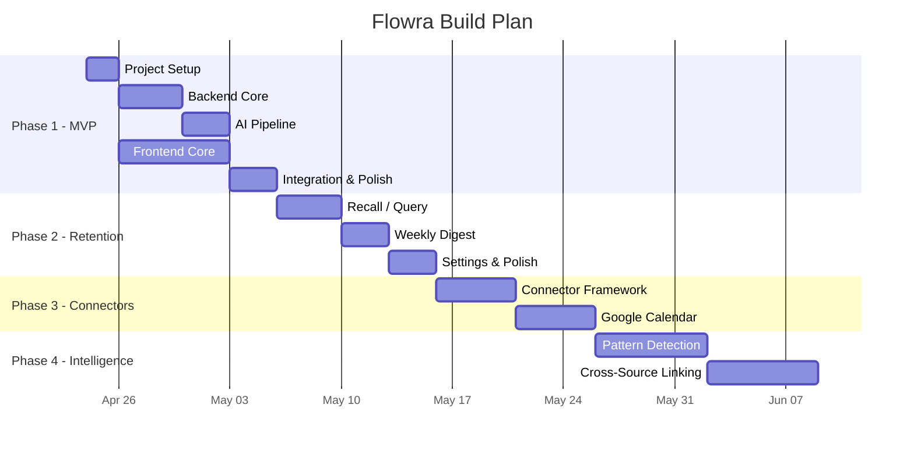

# Flowra — Implementation Plan

> **Version:** 1.0  
> **Date:** 2026-04-23  
> **Status:** Draft — Awaiting Approval  

---

## Document Map

| # | Document | Purpose |
|---|---|---|
| 01 | **PRD** | What we're building, for whom, and why |
| 02 | **Technical Architecture** | System design, data model, tech stack |
| 03 | **UI/UX Spec** | Screens, flows, design system |
| 04 | **Implementation Plan** ← you are here | Build order, phases, tasks |

---

## Phase Overview



---

## Phase 1 — MVP Core (Weeks 1–3)

> **Goal:** A user can capture text, see their timeline, and view auto-extracted state.

### 1.1 Project Setup (Day 1–2)

| Task | Detail | Est. |
|---|---|---|
| Initialize monorepo | Create project structure: `/client`, `/server`, `/shared` | 2h |
| Setup Vite + React | `npx create-vite`, configure React 18, add React Router | 1h |
| Setup Express server | Basic Express app, CORS, error handling middleware | 1h |
| Setup Prisma + SQLite | Schema definition, initial migration | 2h |
| Design system CSS | Implement full design token system from UI/UX spec | 3h |
| Google Fonts + base styles | Inter font, CSS reset, global styles | 1h |
| Dev tooling | ESLint, Prettier, concurrent dev script (client + server) | 1h |

**Deliverable:** Both client and server run locally, DB initialized, design tokens in place.

### 1.2 Backend Core (Day 3–6)

| Task | Detail | Est. |
|---|---|---|
| Auth system | Register, login, JWT middleware, password hashing | 4h |
| Entry CRUD | POST/GET/DELETE entries, pagination, date filtering | 3h |
| State aggregation | `/api/state/today` — aggregate ExtractedStates into DailyState | 3h |
| Input validation | Zod schemas for all request bodies | 2h |
| Error handling | Consistent error response format, logging | 1h |

**Deliverable:** Full API functional, testable via Postman/curl.

### 1.3 AI Pipeline (Day 7–9)

| Task | Detail | Est. |
|---|---|---|
| OpenAI integration | API client setup, retry logic, error handling | 2h |
| State extraction | Prompt engineering, JSON parsing, validation | 4h |
| Async processing | Entry created → queue extraction → store result → recompute state | 3h |
| Fallback handling | What if LLM returns garbage? Graceful degradation. | 2h |

**Deliverable:** Every new entry gets auto-processed. State panel data is real.

### 1.4 Frontend Core (Day 2–9, parallel with backend)

| Task | Detail | Est. |
|---|---|---|
| App layout + sidebar | Responsive shell, navigation, route setup | 3h |
| Login/Register pages | Forms, validation, JWT storage, auth context | 3h |
| Capture input component | Expandable textarea, submit handler, optimistic UI | 3h |
| Timeline feed | Entry cards, badges, date grouping, scroll | 4h |
| State panel | 4 metric cards, color coding, loading states | 3h |
| Empty states | Friendly messages when no data exists | 1h |
| Micro-animations | Entry slide-in, badge stagger, counter roll | 3h |

**Deliverable:** Full Today View working end-to-end.

### 1.5 Integration & Polish (Day 10–12)

| Task | Detail | Est. |
|---|---|---|
| Connect frontend ↔ backend | API service layer, error handling, loading states | 3h |
| Real-time state update | After entry, poll for extraction result, update state panel | 2h |
| Responsive testing | Test all breakpoints, fix layout issues | 2h |
| Bug fixes & edge cases | Empty states, long text, rapid submissions | 3h |

**Deliverable:** ✅ MVP is functional. User can sign up, capture, see timeline and state.

---

## Phase 2 — Retention Features (Weeks 4–6)

> **Goal:** Users come back daily. Recall and digests prove long-term value.

### 2.1 Recall / Query (Day 13–16)

| Task | Detail | Est. |
|---|---|---|
| Recall API endpoint | Accept query, fetch relevant entries, call LLM, return answer | 4h |
| Entry retrieval strategy | Time-based + keyword matching for context window | 3h |
| Recall UI | Search input, AI answer card, related entries, recent queries | 4h |
| Query history | Store past queries for quick re-access | 2h |

### 2.2 Weekly Digest (Day 17–19)

| Task | Detail | Est. |
|---|---|---|
| Digest generation | Aggregate week's entries → LLM summary → store | 3h |
| Digest API | `GET /api/digest/week` | 1h |
| Digest UI | Card in Today View showing weekly summary | 2h |
| Scheduled computation | Compute digest Sunday night or on-demand | 2h |

### 2.3 Settings & Polish (Day 20–22)

| Task | Detail | Est. |
|---|---|---|
| Settings page | Profile edit, theme toggle, data export | 3h |
| Dark/Light mode | CSS variables swap, persistent preference | 2h |
| Data export | JSON export of all user data | 2h |
| Performance audit | Bundle size, API response times, LLM latency | 2h |
| Final QA | Cross-browser testing, mobile testing | 3h |

---

## Phase 3 — Connector Framework (Weeks 7–10)

> **Goal:** First external data source flows into Flowra.

### 3.1 Connector Framework (Day 23–27)

| Task | Detail | Est. |
|---|---|---|
| Adapter base class | `auth()`, `fetch()`, `normalize()` interface | 3h |
| OAuth flow infrastructure | Token storage, refresh logic, disconnect | 5h |
| Normalization pipeline | External data → Entry format → store | 3h |
| Permission model | Read/write scopes, user controls | 3h |
| Connector settings UI | Connect/disconnect, scope management | 4h |

### 3.2 Google Calendar Connector (Day 28–32)

| Task | Detail | Est. |
|---|---|---|
| Google OAuth setup | Cloud Console config, redirect flow | 3h |
| Calendar API integration | Fetch today's events, parse structured data | 4h |
| Event → Entry normalization | Map calendar event to Flowra entry format | 2h |
| Slash command: `/calendar today` | Command parser, execute, display results | 3h |
| User approval flow | "Convert these events to entries? [Yes/Select/No]" | 3h |

---

## Phase 4 — Intelligence (Weeks 11+)

> **Goal:** Flowra becomes proactively useful, not just reactive.

| Feature | Description | Est. |
|---|---|---|
| **Pattern Detection** | Analyze weeks of data for recurring behaviors | 1 week |
| **Smart Nudges** | "You usually forget Friday follow-ups" | 3 days |
| **Cross-Source Linking** | Connect related entries across sources | 1 week |
| **Background Sync** | Opt-in periodic pull from connectors | 3 days |

---

## Definition of Done (per phase)

### Phase 1 ✅ when:
- [ ] User can register and log in
- [ ] User can capture free-text entries
- [ ] Entries appear in chronological timeline
- [ ] AI extracts action items, blockers, completions, deadlines, tags
- [ ] State panel shows today's aggregated state
- [ ] UI is responsive and polished (dark mode, animations)
- [ ] Works on Chrome, Firefox, Safari (desktop)

### Phase 2 ✅ when:
- [ ] User can ask natural language questions about past entries
- [ ] Weekly digest is generated and displayed
- [ ] Settings page works (theme, profile, export)
- [ ] Day-7 retention test passes (internal)

### Phase 3 ✅ when:
- [ ] Google Calendar connects via OAuth
- [ ] Events appear as entries in timeline
- [ ] User can approve/reject imported items
- [ ] Disconnect works cleanly

---

## Folder Structure (Planned)

```
flowra/
├── client/                    # Vite + React frontend
│   ├── public/
│   ├── src/
│   │   ├── assets/           # Static assets, fonts
│   │   ├── components/       # Reusable UI components
│   │   │   ├── CaptureInput/
│   │   │   ├── EntryCard/
│   │   │   ├── StatePanel/
│   │   │   ├── Sidebar/
│   │   │   └── ...
│   │   ├── pages/            # Route-level pages
│   │   │   ├── LoginPage/
│   │   │   ├── TodayView/
│   │   │   ├── TimelineView/
│   │   │   ├── RecallView/
│   │   │   └── SettingsPage/
│   │   ├── services/         # API client functions
│   │   ├── context/          # React context (auth, theme)
│   │   ├── hooks/            # Custom React hooks
│   │   ├── styles/           # Global CSS, design tokens
│   │   ├── utils/            # Helpers
│   │   ├── App.jsx
│   │   └── main.jsx
│   ├── index.html
│   └── vite.config.js
│
├── server/                    # Express backend
│   ├── src/
│   │   ├── routes/           # Express route handlers
│   │   ├── services/         # Business logic
│   │   ├── middleware/       # Auth, validation, error
│   │   ├── ai/              # LLM integration
│   │   ├── connectors/      # Phase 3: external connectors
│   │   ├── utils/           # Helpers
│   │   └── index.js         # Entry point
│   └── prisma/
│       ├── schema.prisma
│       └── migrations/
│
├── shared/                    # Shared types/constants
│   └── types.js
│
├── .env.example
├── .gitignore
├── package.json              # Workspace root
└── README.md
```

---

## Ready to Build?

> [!IMPORTANT]
> Before starting, I need your answers on these **open questions** from the PRD:
> 
> 1. **Auth**: Email/password? Or Google OAuth from day 1?
> 2. **AI Provider**: OpenAI (GPT-4o-mini) or Claude? Do you have an API key?
> 3. **Name**: Is "Flowra" final? (affects branding, domain, etc.)
> 4. **Deploy target**: Local-only for now? Or deploy to Vercel/Railway from start?
> 5. **Proceed with Phase 1?** — I'll scaffold the repo and start building.
